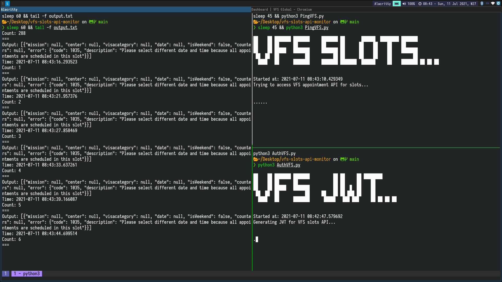

# VFS slots API monitor
These are some **Python 3** scripts written for monitoring the VFS visa application slots API. **Selenium** with **ChromeDriver(webdriver)** used for collecting the JWT, **tmux** used for the UX and **tail** utility used for printing the output in the terminal.

:warning: :bangbang: _**NOTICE**_ :bangbang: :warning: \
_I wrote these scripts to monitor the VFS time slots booking API when I struggled to book one at VFS **Bangladesh** during the Q3 of 2021. And it served it's purpose! But, as I've some other more important things to concentrate now, therefore, maintenance of this project isn't a high priority for me anymore. :no\_entry\_sign: **Hereby, please don't bother me by sending emails regarding this project:heavy\_exclamation\_mark:** However, you can always create GitHub issues though, and I'll go through those when I get a chance. Thank you._

## Installation
This project is developed following the quote _"Code is the best documentation"_, therefore it's better you work it out yourself by analyzing the codebase.

Hints-
- These scripts are crafted for _Linux_ machines.
- You need `python3` installed and configured in you machine.
- Selenium and ChromeWebdriver needed to be installed in the machine.
- For using the `monitor` UX `tmux` also needed to be installed in the machine.
- Understand the `monitor`, `.gitignore` file and the `main()` function of the `*.py` files.
- Rename the `example.*.json` files to `*.json` and set necessary credentials in there.
- Place a `*.mp3` music file as `alert.mp3` in the project root directory.

## License
Copyright (c) 2021 [CodeMascot](https://www.codemascot.com/) AKA [Khan Mohammad R.](https://www.codemascot.com/)

Good news, these scripts are free for everyone! Since these are released under the [MIT License](LICENSE) you can use them free of charge for your personal or commercial interest as long as you follow the [MIT License](LICENSE).

## Contributing

All feedback / bug reports / pull requests are welcome.
